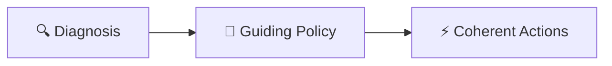

# 🎯 Strategy

> **"Good strategy is a coherent set of analyses, concepts, policies, arguments, and actions that respond to a high-stakes challenge."** — Richard Rumelt

This section defines our strategic kernel: diagnosis, guiding policy, and coherent actions.

---

## 📖 Documents in This Section

| Document | Purpose |
|----------|---------|
| [**Diagnosis**](diagnosis.md) | Understanding our strategic challenge |
| [**Guiding Policy**](guiding_policy.md) | Our approach to overcoming the challenge |
| [**Coherent Actions**](coherent_actions.md) | Specific actions that implement our policy |
| [**Competitive Landscape**](competitive_landscape.md) | Analysis of our competitive environment |

---

## 🧩 The Strategy Kernel

1. **Diagnosis** — What's the nature of the challenge?
2. **Guiding Policy** — What's our overall approach?
3. **Coherent Actions** — What specific moves do we make?

---

## ⚠️ What Makes Bad Strategy

- Failure to face the problem
- Mistaking goals for strategy
- Bad strategic objectives
- Fluff (buzzwords without substance)

!!! warning "Strategy ≠ Goals"
    "We will be #1" is not a strategy. A strategy explains *how* you'll get there.

