# 🔍 Discovery

> **"Fall in love with the problem, not the solution."** — Uri Levine

Continuous Discovery is how we stay connected to customer reality. This section tracks our research, insights, and opportunities.

---

## 📖 Sections

### 👥 [Customers](customers/personas.md)

Understanding who we're building for.

| Document | Purpose |
|----------|---------|
| [Personas](customers/personas.md) | Our target customer profiles |
| [Segments](customers/segments.md) | Market segmentation |
| [Interview Template](customers/interview_template.md) | How we conduct interviews |

### 😤 [Problems](problems/problem_space.md)

The problems worth solving.

| Document | Purpose |
|----------|---------|
| [Problem Space](problems/problem_space.md) | The landscape of problems |
| [Jobs to Be Done](problems/jobs_to_be_done.md) | What customers are hiring us to do |

### 🌳 [Opportunities](opportunities/opportunity_tree.md)

What we're exploring and validating.

| Document | Purpose |
|----------|---------|
| [Opportunity Tree](opportunities/opportunity_tree.md) | Visual map of opportunities |

### 🧪 [Assumptions](assumptions/assumption_map.md)

What we believe (and need to test).

| Document | Purpose |
|----------|---------|
| [Assumption Map](assumptions/assumption_map.md) | Risky assumptions to validate |

---

## 🔄 Discovery Cadence

```mermaid
graph LR
    I[💬 Interview] --> S[📝 Synthesize]
    S --> O[🌳 Update Opportunity Tree]
    O --> P[🎯 Prioritize]
    P --> I
```

Discovery is continuous, not a phase. We interview weekly.

---

!!! tip "The Mom Test"
    Never ask "Would you use this?" Instead, ask about their life, past behavior, and specific situations.

