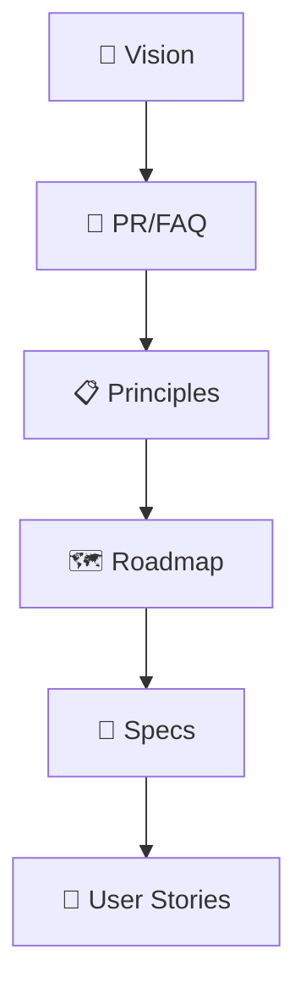

# 📦 Product

> **"Start with the customer and work backwards."** — Jeff Bezos

This section defines what we're building and why — from vision to specs.

---

## 📖 Documents in This Section

| Document | Purpose |
|----------|---------|
| [**Product Vision**](product_vision.md) | Where the product is headed |
| [**PR/FAQ**](pr_faq.md) | Working Backwards document |
| [**Product Principles**](product_principles.md) | How we make product decisions |
| [**Hook Model**](hook_model.md) | How we build habits |
| [**Roadmap**](roadmap.md) | What we're building and when |

---

## 🎯 Product Development Flow

---

## 📰 Working Backwards

We use Amazon's **Working Backwards** method:

1. Write the **Press Release** (PR) as if the product shipped
2. Write **FAQs** from customer and internal perspectives
3. Let this drive what we actually build

The PR/FAQ is our North Star for product development.

---

## 🪝 The Hook Model

We design for healthy habits using Nir Eyal's Hook Model:

1. **Trigger** → What prompts the user?
2. **Action** → What's the simplest behavior?
3. **Variable Reward** → What's the payoff?
4. **Investment** → What brings them back?

See [Hook Model](hook_model.md) for our specific implementation.

---

!!! info "Specs & User Stories"
    Detailed specifications live in the `specs/` folder. User stories are in `user_stories/`.

