# 📊 Validation

> **"No business plan survives first contact with customers."** — Steve Blank

This section tracks our progress through Customer Development stages and key metrics.

---

## 📖 Documents in This Section

| Document | Purpose |
|----------|---------|
| [**Current Stage**](current_stage.md) | ⭐ Where we are right now |
| [**North Star Metric**](metrics/north_star.md) | The one metric that matters |
| [**Dashboard**](metrics/dashboard.md) | Key metrics overview |

---

## 🗺️ Customer Development Stages

```mermaid
graph LR
    S[🔍 Search] --> V[✅ Validation]
    V --> E[⚡ Efficiency]
    E --> SC[📈 Scale]
    
    style S fill:#e1f5fe
    style V fill:#fff3e0
    style E fill:#f3e5f5
    style SC fill:#e8f5e9
```

| Stage | Goal | Key Question |
|-------|------|--------------|
| [**Search**](stages/00_search.md) | Find problem-solution fit | Do people have this problem? |
| [**Validation**](stages/01_validation.md) | Find product-market fit | Will people pay for our solution? |
| [**Efficiency**](stages/02_efficiency.md) | Optimize unit economics | Can we make money? |
| [**Scale**](stages/03_scale.md) | Grow the business | Can we grow efficiently? |

---

## 🎯 Where Are We?

👉 **Check [Current Stage](current_stage.md)** for our latest status.

---

## 📈 Key Metrics

The metrics that matter change by stage:

| Stage | Focus Metrics |
|-------|---------------|
| Search | Problem interviews, Solution interviews |
| Validation | Conversion rate, Retention, Revenue |
| Efficiency | CAC, LTV, LTV/CAC ratio |
| Scale | Growth rate, Market share |

---

!!! warning "Vanity Metrics"
    Avoid metrics that look good but don't drive decisions. Focus on actionable metrics.

