# 💼 Business

> **"A business model describes how your company creates, delivers, and captures value."** — Alexander Osterwalder

This section covers how we make money and reach customers.

---

## 📖 Documents in This Section

| Document | Purpose |
|----------|---------|
| [**Value Proposition**](value_proposition.md) | The value we create for customers |
| [**Business Model Canvas**](business_model_canvas.md) | Visual business model |
| [**Monetization**](monetization.md) | How we make money |
| [**Go to Market**](go_to_market.md) | How we reach customers |

---

## 🧩 Business Model Canvas

```mermaid
graph TB
    subgraph "Front Stage"
        VP[💎 Value Proposition]
        CR[🤝 Customer Relationships]
        CH[📣 Channels]
        CS[👥 Customer Segments]
    end
    
    subgraph "Back Stage"
        KP[🤝 Key Partners]
        KA[⚡ Key Activities]
        KR[🔧 Key Resources]
    end
    
    subgraph "Money"
        CO[💸 Cost Structure]
        RE[💰 Revenue Streams]
    end
    
    KP --> KA
    KA --> VP
    KR --> VP
    VP --> CR
    VP --> CH
    CR --> CS
    CH --> CS
    KA --> CO
    KR --> CO
    CS --> RE
```

See [Business Model Canvas](business_model_canvas.md) for details.

---

## 📋 Legal Documents

| Document | Purpose |
|----------|---------|
| [Privacy Policy](legal/privacy.md) | How we handle user data |
| [Terms of Service](legal/terms.md) | User agreement |

---

!!! tip "Value Proposition First"
    Everything in the business model flows from the value proposition. Start there.

