# 🎨 Design

> **"Design is not just what it looks like and feels like. Design is how it works."** — Steve Jobs

This section defines our visual language and design decisions.

---

## 📖 Documents in This Section

| Document | Purpose |
|----------|---------|
| [**Design Principles**](design_principles.md) | How we approach design decisions |
| [**Design System**](design_system.md) | Components, colors, typography |

---

## 🎯 Design Principles Overview

Our design decisions are guided by clear principles that ensure consistency and quality across all touchpoints.

```mermaid
graph TD
    P[🎯 Principles] --> DS[🧩 Design System]
    DS --> C[🎨 Components]
    DS --> T[📝 Typography]
    DS --> CO[🌈 Colors]
    C --> UI[💻 UI Implementation]
    T --> UI
    CO --> UI
```

---

## 📁 Additional Resources

| Folder | Contents |
|--------|----------|
| `brand/` | Logo, brand assets, guidelines |
| `prototypes/` | Design prototypes and mockups |

---

!!! info "Living Design System"
    Our design system evolves with the product. Check back regularly for updates.

