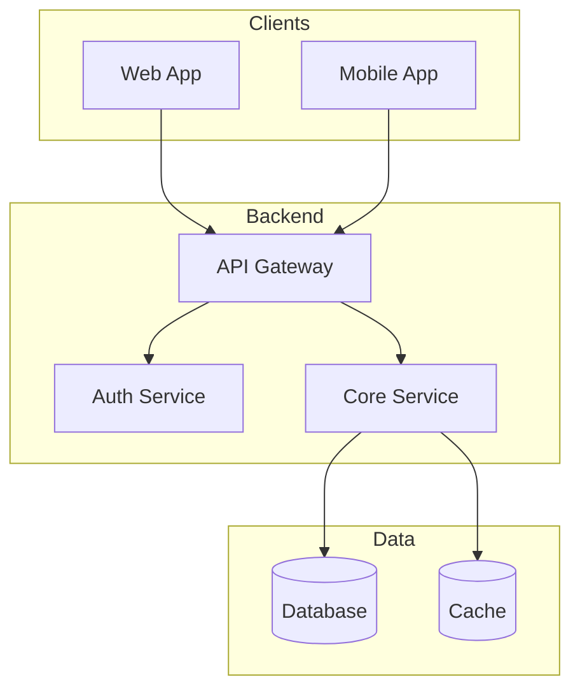

# System Architecture

> "Architecture represents the significant design decisions that shape a system." — Grady Booch

## High-Level Architecture



---

## Component Overview

| Component | Responsibility | Technology |
|-----------|---------------|------------|
| Web App | User interface | |
| API | Request routing | |
| Auth | Authentication | |
| Core | Business logic | |
| Database | Data persistence | |

---

## Key Architectural Decisions

| Decision | Choice | Rationale |
|----------|--------|-----------|
| [Decision 1] | [Choice] | [Why] |
| [Decision 2] | [Choice] | [Why] |

_See `adrs/` for detailed Architecture Decision Records._

---

## Data Flow

### [Flow Name]

```
1. User → [Action]
2. Client → [Request]
3. API → [Processing]
4. Database → [Response]
5. Client → [Display]
```

---

## Security Architecture

### Authentication

- Method: [JWT / Session / OAuth]
- Provider: [Description]

### Authorization

- Model: [RBAC / ABAC]
- Enforcement: [Where/how]

### Data Protection

- Encryption at rest: [Yes/No]
- Encryption in transit: [Yes/No]
- PII handling: [Approach]

---

## Infrastructure

### Environments

| Environment | Purpose | URL |
|-------------|---------|-----|
| Development | Local dev | localhost |
| Staging | Testing | |
| Production | Live users | |

### Deployment

- Strategy: [Blue-green / Rolling / Canary]
- CI/CD: [Tool]
- Hosting: [Provider]

---

## Non-Functional Requirements

| Requirement | Target | Measurement |
|-------------|--------|-------------|
| Availability | 99.9% | Uptime monitoring |
| Response Time | <200ms | P95 latency |
| Scalability | [X] users | Load testing |

---

*Last updated: [Date]*
*Owner: [Name]*

