# ⚙️ Engineering

> **"First make it work, then make it right, then make it fast."** — Kent Beck

This section covers technical architecture, decisions, and documentation.

---

## 📖 Documents in This Section

| Document | Purpose |
|----------|---------|
| [**Architecture**](architecture.md) | System design and structure |
| [**Tech Stack**](tech_stack.md) | Technologies we use and why |

---

## 🏗️ Architecture Overview

```mermaid
graph TB
    subgraph "Frontend"
        APP[📱 App]
    end
    
    subgraph "Backend"
        API[🔌 API]
    end
    
    subgraph "Infrastructure"
        DB[(🗄️ Database)]
        CACHE[(⚡ Cache)]
    end
    
    APP --> API
    API --> DB
    API --> CACHE
```

See [Architecture](architecture.md) for detailed diagrams and decisions.

---

## 📋 Architecture Decision Records (ADRs)

We document significant technical decisions in ADRs:

| ADR | Topic |
|-----|-------|
| [000 Template](adrs/000_template.md) | How to write ADRs |

---

## 📁 Additional Resources

| Folder | Contents |
|--------|----------|
| `adrs/` | Architecture Decision Records |
| `api/` | API documentation |
| `runbooks/` | Operational runbooks |

---

## 🔧 Development Guidelines

We follow:

- **Clean Architecture** — Separation of concerns
- **SOLID Principles** — Maintainable code
- **Domain-Driven Design** — Business-focused modeling

---

!!! tip "ADRs Are Important"
    When making significant technical decisions, always create an ADR. Future you will thank present you.

