# 📈 Growth

> **"Growth is never by mere chance; it is the result of forces working together."** — James Cash Penney

This section covers how we acquire, activate, and retain users.

---

## 📖 Documents in This Section

### 📣 Marketing

| Document | Purpose |
|----------|---------|
| [**Positioning**](marketing/positioning.md) | How we position in the market |
| [**Messaging**](marketing/messaging.md) | What we say and how we say it |
| [**Channels**](marketing/channels.md) | Where we reach customers |

---

## 🏴‍☠️ Growth Framework

```mermaid
graph LR
    A[🎣 Acquisition] --> AC[⚡ Activation]
    AC --> R[🔄 Retention]
    R --> RE[💰 Revenue]
    RE --> RF[📢 Referral]
    RF --> A
```

**AARRR Metrics (Pirate Metrics):**

| Stage | Question |
|-------|----------|
| **Acquisition** | How do users find us? |
| **Activation** | Do they have a great first experience? |
| **Retention** | Do they come back? |
| **Revenue** | Do they pay? |
| **Referral** | Do they tell others? |

---

## 📁 Additional Resources

| Folder | Contents |
|--------|----------|
| `analytics/` | Analytics setup and dashboards |
| `content/` | Content marketing assets |

---

!!! warning "Growth ≠ Marketing"
    Growth is about the whole funnel, not just acquisition. Focus on retention first.

