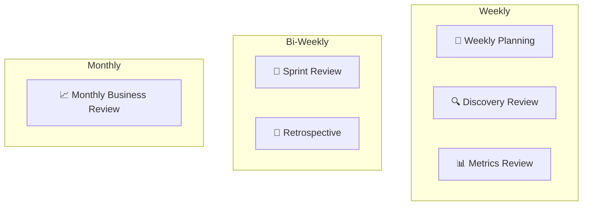

# 🏢 Operations

> **"Culture eats strategy for breakfast."** — Peter Drucker

This section covers how we work as a team.

---

## 📖 Documents in This Section

| Document | Purpose |
|----------|---------|
| [**Rituals**](rituals.md) | Our recurring meetings and practices |
| [**Roles**](team/roles.md) | Team roles and responsibilities |
| [**Org Chart**](team/org_chart.md) | Team structure |

---

## 🔄 Our Rituals

See [Rituals](rituals.md) for the full cadence.

---

## 👥 Team

| Folder | Contents |
|--------|----------|
| [Roles](team/roles.md) | Who does what |
| [Org Chart](team/org_chart.md) | Team structure |

---

## 📁 Additional Resources

| Folder | Contents |
|--------|----------|
| `playbooks/` | Operational playbooks |
| `processes/` | Documented processes |

---

!!! tip "Async First"
    Document decisions in writing. Not everyone can attend every meeting.

