# 💰 Finance

> **"Revenue is vanity, profit is sanity, cash is king."** — Unknown

This section covers financial planning and metrics.

---

## 📖 Documents in This Section

| Document | Purpose |
|----------|---------|
| [**Budget**](budget.md) | Current budget and spend |
| [**Unit Economics**](metrics/unit_economics.md) | CAC, LTV, and profitability |

---

## 📊 Key Financial Metrics

```mermaid
graph LR
    CAC[💸 CAC<br/>Cost to Acquire] --> LTV[💎 LTV<br/>Lifetime Value]
    LTV --> RATIO[📈 LTV/CAC<br/>Ratio]
    
    style RATIO fill:#c8e6c9
```

| Metric | What It Means |
|--------|---------------|
| **CAC** | Cost to acquire one customer |
| **LTV** | Total revenue from one customer |
| **LTV/CAC** | Should be > 3x for healthy business |

---

## 📁 Additional Resources

| Folder | Contents |
|--------|----------|
| `funding/` | Fundraising materials |
| `projections/` | Financial projections |
| `metrics/` | Financial metrics and tracking |

---

!!! danger "Cash Runway"
    Always know how many months of runway you have. Surprises kill startups.

