# Welcome to Startup OS 🚀

> **A Git-powered command center that tracks everything from vision to code.**

---

## 🗺️ Quick Navigation

- :brain: **[Why (Start Here)](00_why/index.md)**
  
    Understand our purpose, vision, and principles before anything else.

- :dart: **[Strategy](01_strategy/index.md)**
  
    Our diagnosis, guiding policy, and coherent actions.

- :mag: **[Discovery](02_discovery/index.md)**
  
    Customer research, problems, and opportunities we're exploring.

- :package: **[Product](03_product/index.md)**
  
    Product vision, PR/FAQ, roadmap, and specifications.

- :chart_with_upwards_trend: **[Validation](04_validation/index.md)**
  
    Current stage, metrics, and progress tracking.

- :briefcase: **[Business](05_business/index.md)**
  
    Business model, monetization, and go-to-market.

- :art: **[Design](06_design/index.md)**
  
    Design system, principles, and brand guidelines.

- :gear: **[Engineering](07_engineering/index.md)**
  
    Architecture, tech stack, and technical decisions.

- :rocket: **[Growth](08_growth/index.md)**
  
    Marketing, positioning, and growth channels.

- :office: **[Operations](09_operations/index.md)**
  
    Team structure, rituals, and processes.

- :moneybag: **[Finance](10_finance/index.md)**
  
    Budget, projections, and unit economics.

- :notebook: **[Journal](journal/index.md)**
  
    Decisions, learnings, and weekly updates.

---

## 🏗️ How This System Works

```mermaid
graph TD
    subgraph "🧠 The Brain - Strategy & Discovery"
        WHY[00_why<br/>Start with Why] --> STRATEGY[01_strategy<br/>Good Strategy]
        STRATEGY --> DISCOVERY[02_discovery<br/>Continuous Discovery]
        DISCOVERY --> PRODUCT[03_product<br/>Working Backwards]
        PRODUCT --> VALIDATION[04_validation<br/>Customer Development]
    end
    
    subgraph "💼 The Business"
        VALIDATION --> BUSINESS[05_business<br/>Business Model]
        BUSINESS --> GROWTH[08_growth<br/>Go-to-Market]
        GROWTH --> FINANCE[10_finance<br/>Unit Economics]
    end
    
    subgraph "⚙️ The Engine - Build"
        PRODUCT --> DESIGN[06_design<br/>Design System]
        DESIGN --> ENGINEERING[07_engineering<br/>Architecture]
        ENGINEERING --> CODE[src/<br/>Code]
    end
    
    subgraph "🔄 Operations"
        OPS[09_operations<br/>Team & Process]
        JOURNAL[journal/<br/>Learnings]
    end
    
    CODE --> VALIDATION
    FINANCE --> JOURNAL
    OPS --> JOURNAL
```

---

## 📖 Key Documents

| Document | Description |
|----------|-------------|
| [Why We Exist](00_why/why.md) | Our core purpose (Golden Circle) |
| [PR/FAQ](03_product/pr_faq.md) | Product vision (Working Backwards) |
| [Current Stage](04_validation/current_stage.md) | Where we are in Customer Development |
| [Opportunity Tree](02_discovery/opportunities/opportunity_tree.md) | What we're exploring |
| [Architecture](07_engineering/architecture.md) | Technical architecture |

---

## 🚀 Getting Started

### For New Team Members

1. **Start with Why** → Read [00_why/](00_why/index.md) to understand our mission
2. **Understand Strategy** → Review [01_strategy/](01_strategy/index.md) for context
3. **Check Progress** → See [Current Stage](04_validation/current_stage.md)
4. **Learn How We Work** → Look at [Rituals](09_operations/rituals.md)

### Quick Links

- 📊 [Current Stage](04_validation/current_stage.md) - Where are we?
- 🎯 [North Star Metric](04_validation/metrics/north_star.md) - What matters most?
- 👥 [Personas](02_discovery/customers/personas.md) - Who are we building for?
- 🗺️ [Roadmap](03_product/roadmap.md) - What's next?

---

## 📚 Frameworks Used

This Startup OS is built on proven frameworks:

| Framework | Applied In |
|-----------|------------|
| Start with Why | `00_why/` |
| Good Strategy Bad Strategy | `01_strategy/` |
| The Mom Test | `02_discovery/` |
| Continuous Discovery Habits | `02_discovery/` |
| Working Backwards (PR/FAQ) | `03_product/` |
| Hooked | `03_product/hook_model.md` |
| The Startup Owner's Manual | `04_validation/` |
| Business Model Canvas | `05_business/` |

---

!!! tip "Tip for AI Assistants"
    If you're an AI assistant (Cursor, Claude, etc.), start with `00_why/` to understand our purpose, then check `01_strategy/` for context before making suggestions.

