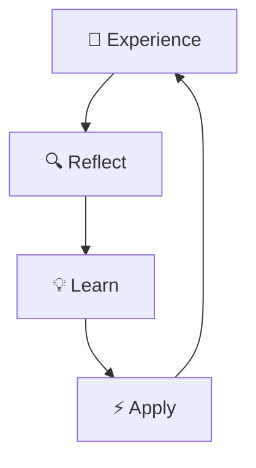

# 📓 Journal

> **"Those who cannot remember the past are condemned to repeat it."** — George Santayana

This section captures our journey — decisions made, lessons learned, and regular updates.

---

## 📖 Documents in This Section

| Document | Purpose |
|----------|---------|
| [**Weekly Updates**](weekly_updates.md) | Regular progress updates |

---

## 📁 Journal Sections

| Folder | Purpose |
|--------|---------|
| `decisions/` | Major decisions and their rationale |
| `learnings/` | Lessons learned (wins and failures) |
| `meetings/` | Important meeting notes |
| `retrospectives/` | Team retrospectives |

---

## 🎯 Why Keep a Journal?

**Benefits:**

1. **Institutional Memory** — Know why decisions were made
2. **Onboarding** — New team members learn from history
3. **Pattern Recognition** — Spot recurring issues
4. **Accountability** — Track what we said we'd do

---

## ✍️ Writing Guidelines

When adding to the journal:

1. **Be specific** — Names, dates, numbers
2. **Include context** — What was happening at the time?
3. **Note the outcome** — What happened as a result?
4. **Extract learnings** — What would we do differently?

---

!!! tip "Weekly Updates"
    Check [Weekly Updates](weekly_updates.md) for the latest on what's happening.

